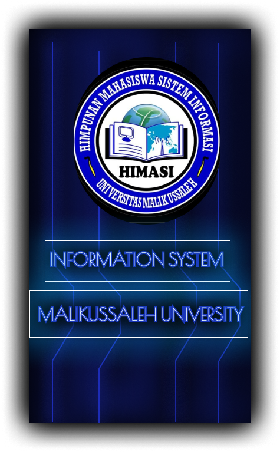
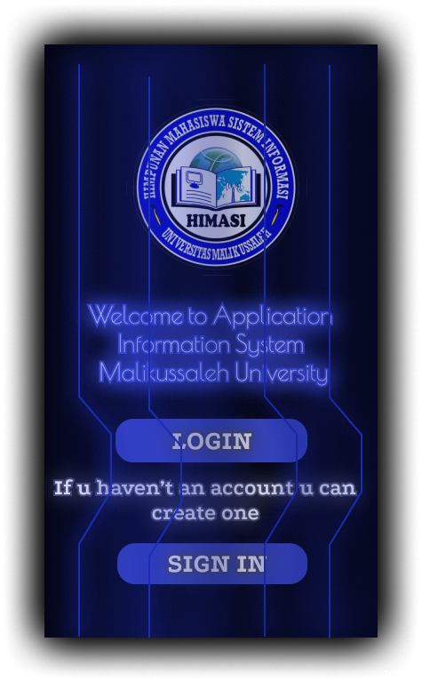
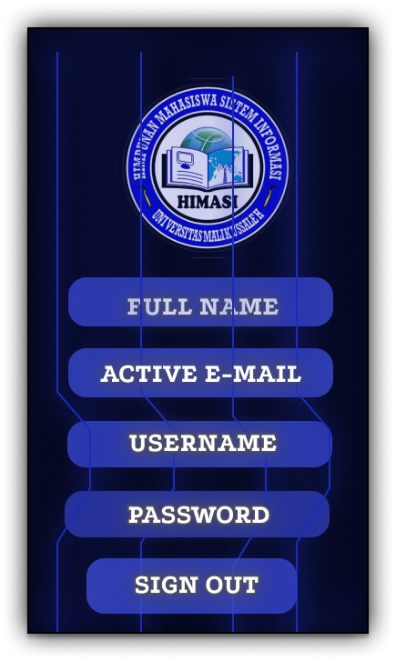
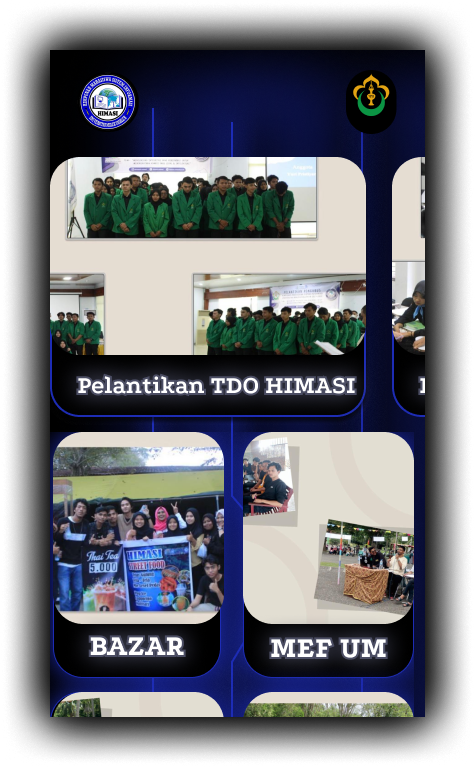

# UI/UX Design — HIMASI Student Association App

Designed a mobile information system for HIMASI (Himpunan 
Mahasiswa Sistem Informasi) Universitas Malikussaleh to 
centralize member management and event documentation.

## Key Screens
- Welcome & Login
- Member Registration
- Event Gallery & Activities

## Tools
- Figma

## Design Preview
[View Full Design on Figma]([https://www.figma.com/design/DedVxUbbLMCUzJoGyMPQJp/KELOMPOK-5-A5-PEM.MOB-I?node-id=0-1&t=JBHeE2bb7zllKLs1-1])

## Screenshots

